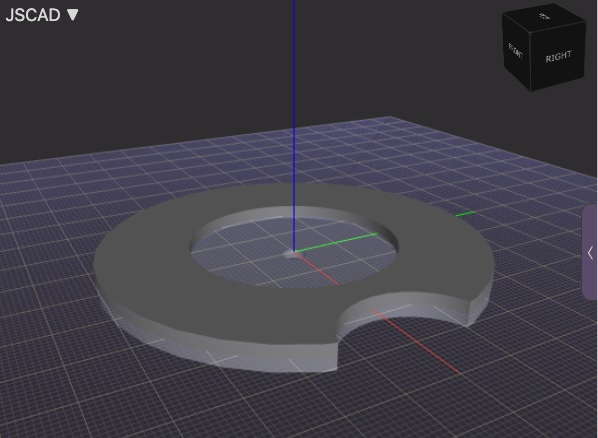

# 3D-Prints
Models for 3D Printers

[JSCAD](https://jscad.app) is a web browser app for creating parametric 2D and 3D CAD designs.

* * *

* [Spool Disk](BaseSpoolDisk.stl):  Prevents loose thread from getting tangled beneath the spool
  

